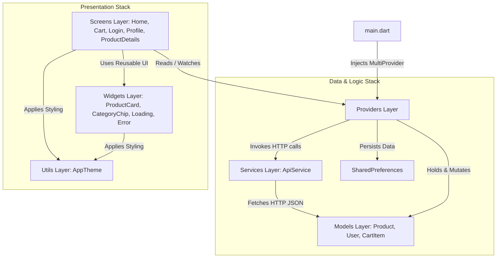

# Page 2: Directory & Architecture Overview

This page explains how the project directory is organized, how architectural layers are defined, and how data and events flow between folders.

---

## 1. High-Level Folder Structure

```
ecommerce_app/
│
├── android/                   # Native Android wrapper & configuration
├── ios/                       # Native iOS wrapper & configuration
├── web/                       # Web entry point & index.html
├── windows/                   # Native Windows desktop app wrapper
├── macos/                     # Native macOS desktop app wrapper
├── linux/                     # Native Linux desktop app wrapper
│
├── assets/                    # Bundled static resources (images, fonts)
│   └── images/                # Image asset folder
│
├── docs/                      # Comprehensive technical documentation pages
│   ├── index.md               # Documentation Master Index
│   ├── 01_flutter_architecture_and_concepts.md
│   ├── 02_directory_and_architecture_overview.md
│   ├── 03_models_and_services.md
│   ├── 04_state_management_and_providers.md
│   ├── 05_screens_widgets_and_styling.md
│   └── 06_testing_and_platform_configurations.md
│
├── lib/                       # Primary application Dart source code
│   ├── models/                # Data Transfer Objects & Schema JSON converters
│   ├── services/              # External HTTP API services
│   ├── providers/             # State management & business logic layer
│   ├── screens/               # Screen page layouts
│   ├── widgets/               # Reusable presentational components
│   ├── utils/                 # Design system theme & tokens
│   └── main.dart              # Application entry point & provider bootstrapping
│
├── test/                      # Unit, Provider, and Widget test suite
│
├── pubspec.yaml               # Dependency manifest & app configuration
├── pubspec.lock               # Exact version dependency lockfile
├── analysis_options.yaml      # Dart static analysis & linter rules
├── README.md                  # High-level project summary
└── DOCUMENTATION.md           # Master entry documentation
```

---

## 2. Layered Architecture Principles

The project strictly follows a **Layered Architecture** with unidirectional data flow. Each layer has a clear single responsibility:

```
+-------------------------------------------------------------+
|                      PRESENTATION LAYER                     |
|            (lib/screens/ & lib/widgets/ & lib/utils/)       |
+------------------------------+------------------------------+
                               | Reads state / Triggers actions
                               v
+-------------------------------------------------------------+
|                     STATE MANAGEMENT LAYER                  |
|                      (lib/providers/)                       |
+------------------------------+------------------------------+
                               | Calls services / Mutates models
                               v
+------------------------------+------------------------------+
|                        SERVICES LAYER                       |
|                      (lib/services/)                        |
+------------------------------+------------------------------+
                               | Fetches REST HTTP Data
                               v
+-------------------------------------------------------------+
|                         MODELS LAYER                        |
|                       (lib/models/)                         |
+-------------------------------------------------------------+
```

### 2.1 Layer Responsibilities & Rules

1. **Models Layer (`lib/models/`)**:
   - Pure Dart objects containing zero Flutter UI dependencies.
   - Enforces strict type conversion from JSON dynamic maps.
   - Independent of all upper layers.

2. **Services Layer (`lib/services/`)**:
   - Handles network requests (`http` package), endpoints, headers, timeouts, and HTTP status codes.
   - Parses raw HTTP JSON strings into Model instances.
   - Throws custom domain exceptions ([ApiException](file:///c:/Users/hp/OneDrive/Desktop/insa_projects/ecommerce_app/lib/services/api_service.dart#L7)).

3. **Providers Layer (`lib/providers/`)**:
   - Encapsulates reactive application state and business logic.
   - Invokes `ApiService` for network operations and `SharedPreferences` for local disk persistence.
   - Broadcasts updates to the Presentation layer via `notifyListeners()`.

4. **Presentation Layer (`lib/screens/`, `lib/widgets/`, `lib/utils/`)**:
   - `screens/`: Handles page routing, app bar titles, scaffold layouts, and user interactions.
   - `widgets/`: Pure reusable atomic UI components (cards, chips, loaders, error indicators).
   - `utils/`: Centralized theme tokens, colors, typography, and Material 3 styles ([app_theme.dart](file:///c:/Users/hp/OneDrive/Desktop/insa_projects/ecommerce_app/lib/utils/app_theme.dart)).

---

## 3. Folder Communication & Data Flow



### 3.1 Folder Interaction Scenarios

- **Scenario A: User Logs In**:
  1. User enters text in [login_screen.dart](file:///c:/Users/hp/OneDrive/Desktop/insa_projects/ecommerce_app/lib/screens/login/login_screen.dart).
  2. UI calls `context.read<AuthProvider>().login(username, password)`.
  3. [auth_provider.dart](file:///c:/Users/hp/OneDrive/Desktop/insa_projects/ecommerce_app/lib/providers/auth_provider.dart) invokes [api_service.dart](file:///c:/Users/hp/OneDrive/Desktop/insa_projects/ecommerce_app/lib/services/api_service.dart#L21) `login()`.
  4. On success, `AuthProvider` stores the token to disk (`SharedPreferences`), sets `isAuthenticated = true`, and notifies listeners.
  5. [main.dart](file:///c:/Users/hp/OneDrive/Desktop/insa_projects/ecommerce_app/lib/main.dart#L41) (`AuthWrapper`) automatically rebuilds and switches the view from `LoginScreen` to `HomeScreen`.

- **Scenario B: Filtering Products by Search or Category**:
  1. User types query in search bar on [home_screen.dart](file:///c:/Users/hp/OneDrive/Desktop/insa_projects/ecommerce_app/lib/screens/home/home_screen.dart).
  2. `HomeScreen` executes `context.read<ProductProvider>().setSearchQuery(query)`.
  3. [product_provider.dart](file:///c:/Users/hp/OneDrive/Desktop/insa_projects/ecommerce_app/lib/providers/product_provider.dart#L35) updates internal query and computes `filteredProducts`.
  4. `notifyListeners()` triggers `HomeScreen` rebuild.
  5. Grid updates to render matching [product_card.dart](file:///c:/Users/hp/OneDrive/Desktop/insa_projects/ecommerce_app/lib/widgets/product_card.dart) widgets.
